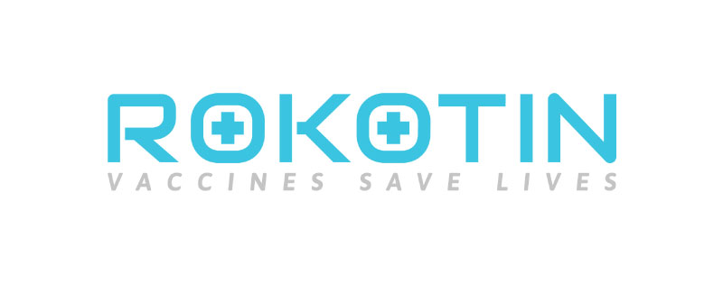

# Rokotin

Team Vaccify is developing Rokotin, the first vaccination-promotion application designed specifically for the Finnish vaccination program. We want to collaborate with THL (the National Institute for Health and Welfare) and use Rokotin to fill the disconnected void between the national vaccination program and OmaKanta (the national electronic health record system).

With Rokotin, users can easily keep track of the vaccination progress for themselves and their dependants (for example, children or adults under their care). Rokotin will also include other handy features, including a travel immunization search, and mini-games to teach about important concepts such as herd immunity.

We are called Team Vaccify because we want to promote cross-border collaboration and create versions of the app for other Nordic countries and even for the entire world. Check out what we’ve made at the Nordic Health Hackathon at [Rokotin.fi](https://rokotin.fi)

## Nordic Health Hackathon 2019

- What we made: https://rokotin.fi
- Our prototype: http://bit.ly/RokotinPrototypeNHH
- Our presentation slides: http://bit.ly/RokotinPresentation
## Authors
Team Vaccify is made up of five developers with diverse professional and personal backgrounds:

- [Xurxe Toivo García](https://github.com/xurxe): team leader, writer, developer (biology, Galicia/Spain)
- [André Vollrath](https://github.com/avollrath): UI/UX designer, developer (graphic design, Germany)
- [Sulaymon Tajudeen](https://github.com/Sulaymon333): developer (engineering and business, Nigeria)
- [Phuc Nguyen](https://github.com/StevePhuc): developer (business, Vietnam)
- [Hari Basnet](https://github.com/haribasnet0): developer (engineering, Nepal)

## Wiki

Learn how to interact with this repository at https://github.com/xurxe/Rokotin-NHH/wiki

## License

Coming soon.

## Acknowledgments

- [Integrify](https://github.com/Integrify-Finland), for giving us the tools to become successful developers
- The [Nordic Health Hackathon](https://nordichealthhackathon.com/), for giving us the space and inspiration to create Rokotin